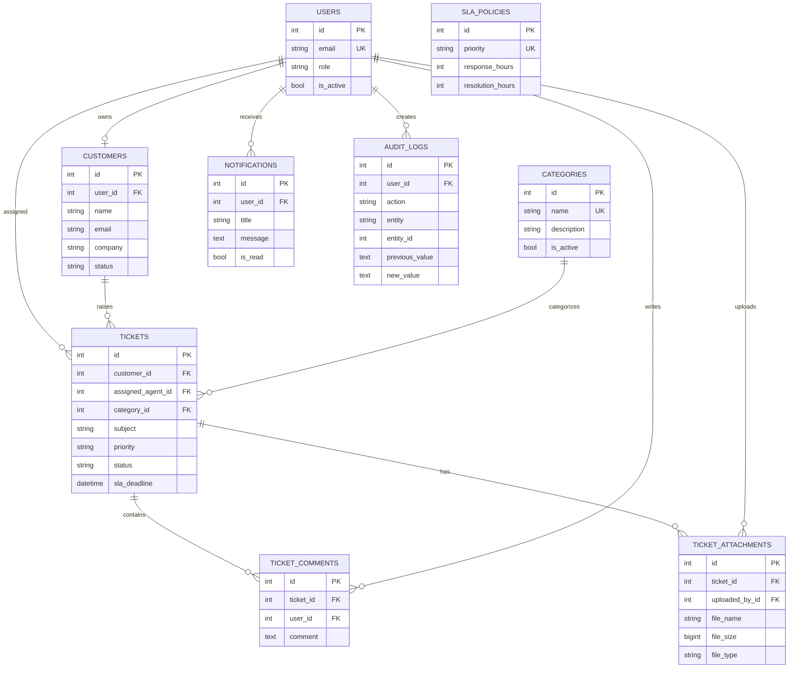

# Database Schema

```mermaid
erDiagram
  USERS ||--o| CUSTOMERS : owns
  USERS ||--o{ TICKETS : assigned
  CUSTOMERS ||--o{ TICKETS : raises
  CATEGORIES ||--o{ TICKETS : categorizes
  TICKETS ||--o{ TICKET_COMMENTS : contains
  USERS ||--o{ TICKET_COMMENTS : writes
  TICKETS ||--o{ TICKET_ATTACHMENTS : has
  USERS ||--o{ TICKET_ATTACHMENTS : uploads
  USERS ||--o{ NOTIFICATIONS : receives
  USERS ||--o{ AUDIT_LOGS : creates

  USERS { int id PK string email UK string role bool is_active }
  CUSTOMERS { int id PK int user_id FK string name string email string company string status }
  CATEGORIES { int id PK string name UK string description bool is_active }
  TICKETS { int id PK int customer_id FK int assigned_agent_id FK int category_id FK string subject string priority string status datetime sla_deadline }
  TICKET_COMMENTS { int id PK int ticket_id FK int user_id FK text comment }
  TICKET_ATTACHMENTS { int id PK int ticket_id FK int uploaded_by_id FK string file_name bigint file_size string file_type }
  SLA_POLICIES { int id PK string priority UK int response_hours int resolution_hours }
  NOTIFICATIONS { int id PK int user_id FK string title text message bool is_read }
  AUDIT_LOGS { int id PK int user_id FK string action string entity int entity_id text previous_value text new_value }
```
